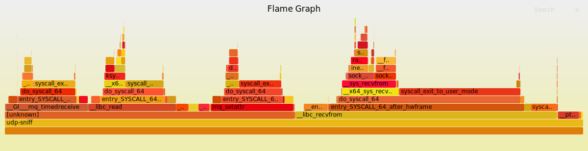

# Сопроводительная документация <!-- omit in toc -->

<div class="page"/>

# Cодержание <!-- omit in toc -->

- [Описание](#описание)
  - [Варианты запуска](#варианты-запуска)
  - [Коммуникация между утилитами](#коммуникация-между-утилитами)
- [Сборка](#сборка)
  - [Сборка из исходных файлов](#сборка-из-исходных-файлов)
  - [Сборка из архива](#сборка-из-архива)
- [Запуск утилит](#запуск-утилит)
  - [Привилегии udp-sniff](#привилегии-udp-sniff)
  - [Запуск udp-sniff](#запуск-udp-sniff)
  - [Запуск print-stats](#запуск-print-stats)
  - [Подача трафика на интерфейс](#подача-трафика-на-интерфейс)
- [Профилирование двух опций запуска udp-sniff](#профилирование-двух-опций-запуска-udp-sniff)
  - [Профилирование программы с первой опцией](#профилирование-программы-с-первой-опцией)
  - [Профилирование программы со второй опцией](#профилирование-программы-со-второй-опцией)
  - [Результат профилирования](#результат-профилирования)
- [Авторство и лицензия](#авторство-и-лицензия)
  - [Автор](#автор)
  - [Лицензия](#лицензия)

<div class="page"/>


# Описание

Данная работа представляет собой реализацию набора программного обеспечения, который собирает и отображает статистику по трафику на заданном сетевом интерфейсе.

Набор ПО состоит из двух утилит:
1. `udp-sniff` - читает данные с сетевого интерфейса и собирает статистику (количество пакетов и байтов) по пакетам. Сбор статистики ведётся по UDP пакетам по указанным при запуске утилиты параметрам: IP-адрес источника, IP-адрес назначения, порт источника, порт назначения.
2. `print-stats` - получает собранную статитику у первой утилиты и выводит её на экран.

## Варианты запуска
Первая утилита реализована в двух вариантах, различающихся в способе передачи статистики между двумя потоками (потоком считывания пакетов с интерфейса `sniff_packets` и потоком, передающим статистику по запросу `provide_stats`):
1. `sniff_packets` проверяет параметры пакетов и для подходящих **передаёт статистику во второй поток.** `provide_stats` **суммирует статистику** и отдаёт её по запросу.
   
   Здесь механизмом синхронизации потоков выступает канал (pipe): первый поток записывает прошедший по параметрам пакет в канал, второй - читает из него.

2. `sniff_packets` проверяет параметры пакетов и для подходящих **суммирует статистику.** `provide_stats` отдаёт её по запросу.
   
   В этом случае суммируемая статистика передаётся через глобальную переменную, а механизмом синхронизации выступает мьютекс. Первый поток добавляет статистику к глобальной переменной, второй - копирует в локальную переменную.

## Коммуникация между утилитами
Коммунакция между этими утилитами осуществялется с помощью [POSIX Message Queue](https://man7.org/linux/man-pages/man7/mq_overview.7.html).

Первая утилита при запуске создаёт очередь сообщений для приёма запросов на предоставление статистики. Позволяется запустить только одну копию udp-sniff, поскольку имя очереди сообщений предопределено в исходном коде.

Вторая утилита по заранее определённому имени отправляет запрос на получение статистики. Перед отправкой запроса создаётся очередь сообщений для получения ответа и её имя помещается в сообщение запроса. В ответе содержится имя интерфейса, на котором собиралась статистика, параметры пакетов и статистика (количество пакетов и суммарное количество байт в этих пакетах).


# Сборка

## Сборка из исходных файлов
В этом проекте используется система сборки GNU Autotools, поэтому необходимо установить пакет autoconf:

```bash
apt-get install autoconf
```

Для сборки необходимо из директории с исходным кодом запустить следующие команды:

```bash
$ autoreconf --install
$ mkdir build && cd build
$ ../configure --prefix /path/to/install
$ make install
```

После выполнения этих команд в каталоге /path/to/install/bin (или если команда `configure` была выполнена без опции prefix - в стандартных директориях /usr/bin или /usr/local/bin) будет создано два исполняемых файла: `udp-sniff` и `print-stats`.

## Сборка из архива
Для сборки необходимо из каталога с распакованным исходным кодом запустить следующие команды:

```bash
$ ./configure --prefix /path/to/install
$ make install
```

Будут созданы те же файлы, что и при сборке с помощью первого варианта.

<div class="page"/>

# Запуск утилит
## Привилегии udp-sniff
В утилите `udp-sniff` для прослушивания трафика на интерфейсе используется [Raw Socket](https://man7.org/linux/man-pages/man7/raw.7.html), требующий привилегии CAP_NET_RAW. Чтобы её установить, необходимо выполнить команду:

```bash
$ sudo setcap cap_net_raw+ep ./udp-sniff
```

Либо необходимо запускать `udp-sniff` и `print-stats` с правами root (с помощью sudo).

## Запуск udp-sniff
Утилита `udp-sniff` принимает на вход до 6 аргументов:
- имя интерфейса.
- опциональный: вариант исполнения программы (см. раздел "Описание. Варианты запуска"). По умолчанию - второй вариант.
- 4 опциональных (отвечающих за фильтрацию пакетов): IP-адрес источника, IP-адрес назначения, порт источника, порт назначения. Если опция не указана, то для соответствующего параметра устанавливается значение по умолчанию `0`. Это значение указывает, что любой ip адрес (или порт) соответсвующего параметра пакета будет учитываться в статистике.

  ```bash
  $ udp-sniff lo --dest-ip 127.0.0.1 --dest-port 1234
  ```

## Запуск print-stats
Утилита `print-stats` не принимает аргументов:

  ```bash
  $ print-stats
  Device name: lo
  -------------------------------------------
  source ip       sport dest ip         dport
  0               0     127.0.0.1       1234 
  -------------------------------------------
  packets 0 bytes 0
  ```


## Подача трафика на интерфейс
Следующий скрипт передаёт 100000 байт (без учёта заголовков) с помощью netcat. Перед этим необходимо запустить `udp-sniff`, как показано в разделе "Запуск udp-sniff".

```bash
$ nc -ul 127.0.0.1 1234 > /dev/null &
$ cat /dev/urandom | base64 | head -c 100000 | nc -u 127.0.0.1 1234
```

Вызов `print-stats` показывает следующее:

```bash
$ ./print-stats /mq-udpsniff_lo_0_0_127.0.0.1_1234
Device name: lo
-------------------------------------------
source ip       sport dest ip         dport
0               0     127.0.0.1       1234 
-------------------------------------------
packets 7 bytes 100294
```

Видно, что с интерфейса прочитано 100294 байт данных: 100000 байт, указанных при запуске netcat, и 294 байт - суммарный размер заголовков ethernet, ip и udp (по 42 байт на каждый пакет).


# Профилирование двух опций запуска udp-sniff

Профилирование проводилось в системе, некоторые характеристики которой следующие:
```
OS: Ubuntu 20.04.4 LTS x86_64
Kernel: 5.13.0-51-generic

# perf version : 5.13.19
# arch : x86_64
# nrcpus avail : 4
# cpudesc : Intel(R) Core(TM) i5-4690K CPU @ 3.50GHz
# total memory : 16336032 kB
```

При профилировании на интерфейсе бесконечно генерируется трафик следующим образом:

```bash
$ nc -ul 127.0.0.1 1234 > /dev/null &
$ nc -u 127.0.0.1 1234 < /dev/urandom
```

Профилирование проводилось с помощью perf_events и построения флейм графов с помощью утилиты [FlameGraph](https://github.com/brendangregg/FlameGraph).

Сборка проекта проводилось с флагом -fno-omit-frame-pointer (`../configure CFLAGS='-g -O0 -fno-omit-frame-pointer'`).

## Профилирование программы с первой опцией
```bash
$ ./udp-sniff lo --dest-ip 127.0.0.1 --dest-port 1234 -e opt1 &
[1] 5022
$ sudo perf record -F 999 -p 5022 -g -- sleep 30
```

  
*(Всего 59733 samples)*

На синхронизацию посредством pipe уходит:
* В sniff_packets:  
  __lic_write - 101 samples, 0.17%
		
* В provide_stats:  
  __libc_read - 9065 samples, 15.18%

## Профилирование программы со второй опцией
```bash
$ ./udp-sniff lo --dest-ip 127.0.0.1 --dest-port 1234 -e opt2 &
[1] 5068
$ sudo perf record -F 999 -p 5068 -g -- sleep 30
```

  
*(Всего 59903 samples)*

На синхронизацию посредством разделяемой переменной уходит:
* В sniff_packets:  
  __pthread_mutex_lock  	- *не попало в выборку*, меньше 0.01%  
  __pthread_mutex_unlock - 6 samples, 0.01%

* В provide_stats:  
  __pthread_mutex_lock 	- 2055 samples, 3.43%  
  __pthread_mutex_unlock - 111 samples, 0.19%

## Результат профилирования
По приведённым данным видно, что применение разделяемой переменной эффективнее, так как используется меньше процессорного времени.

Также обратим внимание на пропускную способность.
Данные в буферe приема сокета могут быть потеряны (перезаписаны), если не будет вовремя произведена операция чтения с сокета. Поэтому более предпочтительный вариант по параметру пропускной способности является тот, в котором остальные операции занимают меньше процессорного времени. Хотя в потоке sniff_packets в обоих вариантах механизмы синхронизации занимают несущественное время, здесь также второй вариант лучше.


# Авторство и лицензия
## Автор
Copyright (c) 2022 Доленко Дмитрий <<dolenko.dv@yandex.ru>>
## Лицензия
Исходный код распространяется под лицензией MIT.
